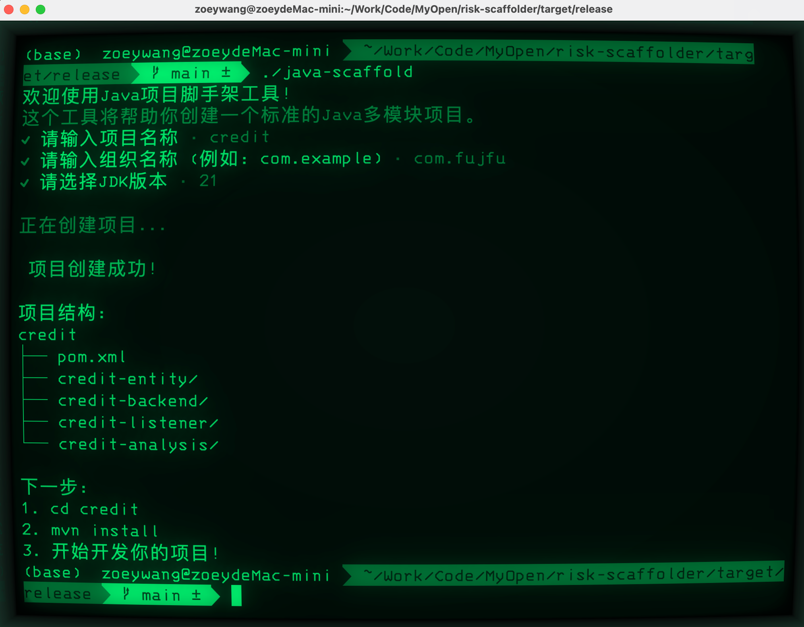

# Java 多模块项目生成器

一个用 Rust 编写的命令行工具，用于快速生成标准化的 Java Maven 多模块项目结构。

## 功能特点

- 一键生成完整的 Maven 多模块项目结构
- 自动创建标准化的项目目录结构
- 生成配置完善的 pom.xml 文件
- 包含常用模块：entity、backend、listener、analysis

## 安装方法

### Windows 用户
1. 下载 release/`项目名.exe`
2. 将可执行文件放置在任意目录
3. 建议将所在目录添加到系统环境变量 PATH 中

### Linux/MacOS 用户
1. 下载 release/`项目名` 可执行文件
2. 添加执行权限：

```bash
chmod +x ./项目名
```


## 交互式配置

工具会引导您完成以下配置：

### 项目名称设置
- 输入规则：
  - 不能为空
  - 只能包含字母、数字、横线（-）和下划线（_）
  - 建议使用小写字母，如：`risk-analysis-platform`

### 组织名称设置
- 默认值：`com.example`
- 输入规则：
  - 不能为空
  - 必须包含至少一个点号（.）
  - 示例：`com.company.risk`

### JDK 版本选择
- 支持版本：
  - JDK 8
  - JDK 11
  - JDK 17（默认选项）
  - JDK 21
- 使用方向键选择合适的版本

### 项目结构

工具将在当前目录下生成如下结构：

```
your-project-name/
├── pom.xml # 父 POM 文件
├── your-project-name-entity/ # 实体模块
├── your-project-name-backend/ # 后端核心模块
├── your-project-name-listener/# 监听器模块
└── your-project-name-analysis/# 分析模块
```


## 开始开发您的项目

### 模块说明

- **entity**: 数据实体类模块
- **backend**: 核心业务逻辑实现
- **listener**: 事件监听和处理
- **analysis**: 风控分析相关功能

### 注意事项

1. 确保在执行前已安装 Maven
2. 确保目标目录具有写入权限
3. 建议使用有意义的项目名称，便于后期维护
4. 组织名称应符合公司或团队的命名规范

### 常见问题

Q: 如何修改默认的 Maven 依赖版本？
A: 可以在生成项目后，直接修改根目录下的 pom.xml 文件。

Q: 生成的项目支持哪些 IDE？
A: 生成的项目是标准的 Maven 项目，支持所有主流 Java IDE（如 IntelliJ IDEA、Eclipse 等）。

## 技术支持

如遇到问题，请联系风控系统部技术支持团队。

